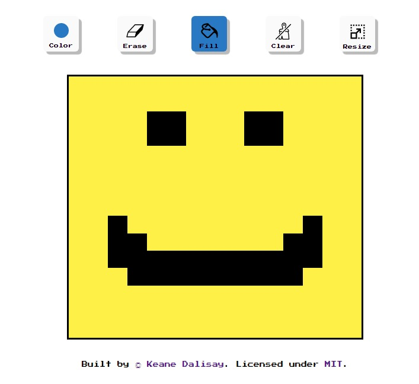

# Project Etch-a-Sketch Presents: Pixel Art

## An in-the-browser pixel themed sketchpad where you can sketch anything you like!

This project is like all other Etch-a-Sketch projects except I gave a pixel theme to it as well as creating the design for the project on Figma. Pixel Art's features include:

* The ability to resize the canvas.
* The ability to toggle a grid for the canvas.
* The ability to sketch the canvas with the color you want.
* Eraser.
* The option to either completely fill or clear the canvas of color.

You may notice when visiting the full website and clicking the erase button, it has a slider which is used to adjust the size of the eraser.

Sadly, *it does not work at the time of writing 31/07/2022*. You only get to erase one block at a time, even if you adjusted the slider to its max value.
## Where to visit this project?

Feel free to visit the full website through this link: https://keanedalisay.github.io/etch-a-sketch-TOP/

And here is an image preview of it:

## License

Copyright (c) 2022 Keane Dalisay

The content of this repository is licensed under <a href="LICENSE">MIT</a>.
